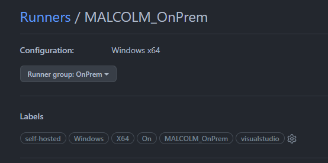

Depuis des années, je m'appuie sur une Release dans Azure DevOps pour mettre à jour les machines que j'ai à la maison : packages chocolatey, instances Visual Studio quand il y en a et encore il y a peu, déclencher Windows Update.

Tout fonctionne très bien.

Mais je me suis posé la question: et si je devais faire la même chose avec GitHub Actions ?

# Equivalent en natif ou solution maison

Tout naturellement, la première idée est de trouver un équivalent implémenté nativement dans GitHub. Ce n'est pas le cas à l'heure où j'écris ces lignes.

On va donc devoir ruser un peu pour essayer d'implémenter un équivalent.

Voyons ce que nous avons à disposition pour tenter de combler ce manque:

Ma première idée a été d'installer et de rassembler les runners (agents dans Azure DevOps) dans des groupes si on travaille dans une organization. Jusque là, si on est familier avec Azure DevOps, on n'est pas perdu. On peut ajouter des labels (sorte de capabilities dans Azure DevOps) pour les différencier.

```yaml
# Lance le pipeline sur un agent qui a les labels choco et visual studio en plus d'être self-hosted
runs-on: self-hosted, choco, visualstudio
```

Ca devrait nous permettre d'arriver à nos fins. Par contre, comme dans Azure DevOps, si j'utilise cette configuration, le premier runner avec ces labels va exécuter mes tâches de mise à jour. C'est pas trop l'objectif.

Il faut trouver une astuce complémentaire.

Un élément intéressant dans les workflow GitHub actions, c'est la possibilité d'exécuter le même job à l'aide d'[une matrix](https://docs.github.com/en/actions/using-jobs/using-a-matrix-for-your-jobs#example-expanding-configurations).

On pourrait donc imaginer récupérer une liste de runners et s'en servir comme input de la matrix. Voyons déjà comment récupérer la liste des runners.

## La liste des runners

On pourrait tout à fait imaginer une liste de runner, écrite quelque part dans un fichier dans notre repo. Mais non, il y a certainement un API pour pouvoir faire ça. Elles sont disponibles et bien documentées.

- [Lister les groupes de Runner dans une organisation](https://docs.github.com/en/rest/actions/self-hosted-runner-groups#list-self-hosted-runner-groups-for-an-organization)
- [Lister les runners dans un groupe dans un group au niveau organisation](https://docs.github.com/en/rest/actions/self-hosted-runner-groups#list-self-hosted-runners-in-a-group-for-an-organization)

Mais cette approche pose un problème de taille : les permissions requises par cette API requièrent la permission `admin:org`. Plutôt radical !

Il existe une autre possibilité : ajouter les agents directement au niveau du repo. L'[API](https://docs.github.com/en/rest/actions/self-hosted-runners#list-self-hosted-runners-for-a-repository) demande un accès `repo` uniquement.

Tout dépend du cas d'usage de notre "Deployment group". Dans mon cas, je pourrais très bien mettre lier mes agents à mon repo et non à mon organisation. C'est un choix à étudier.

Dans tous les cas, les 2 APIs pour lister des runners au niveau Organization ou Repository renvoient un résultat similaire.

Pour récupérer simplement mes runners, je vais utiliser un script PowerShell Core

```powershell
# on récupère les groupes liés à l'organisation en utilisant le context du workflow pour récupérer automatiquement le nom de l'organisation
$groups = gh api /orgs/${{ github.repository_owner }}/actions/runner-groups | ConvertFrom-Json
# on cherche l'ID du groupe qui nous intéresse
$groupId = ($groups.runner_groups | Where-Object { $_.Name -eq "<mongroupe>" }).id
# on récupère les runners
$runners = @()
$runners += (gh api /orgs/${{ github.repository_owner }}/actions/runner-groups/$groupId/runners | ConvertFrom-Json).runners
```

Si on affiche le résulat:
```powershell
$runners | Format-Table
```

On obtient quelque chose de plutôt intéressant:

```
 id name           os      status  busy labels
 -- ----           --      ------  ---- ------
  1 machine1       Windows online False {@{id=1; name=self-hosted; type=read-only}, @{id=2; name=Windows; type=read-only}, @{id=3; name=X64; type=read-only}}
  2 machine2       Windows online False {@{id=1; name=self-hosted; type=read-only}, @{id=2; name=Windows; type=read-only}, @{id=3; name=X64; type=read-only}}
```

On a le nom de l'agent, l'OS et les tags. On verra comment exploiter tout ça plus tard, ou pas.

Pour l'instant, notre workflow ressemble à celui-ci:

```yaml
name: Daily maintenance

on:
  push:
    branches: [ "main" ]
  pull_request:
    branches: [ "main" ]

  workflow_dispatch:

  listagents:
    name: 📃 List agents
    runs-on: ubuntu-latest
    steps:
      - name: List agents
        env:
          GITHUB_TOKEN: ${{ secrets.ADMINORG }}  
        shell: pwsh
        run: |
            # on récupère les groupes liés à l'organisation en utilisant le context du workflow pour récupérer automatiquement le nom de l'organisation
            $groups = gh api /orgs/${{ github.repository_owner }}/actions/runner-groups | ConvertFrom-Json
            # on cherche l'ID du groupe qui nous intéresse
            $groupId = ($groups.runner_groups | Where-Object { $_.Name -eq "<mongroupe>" }).id
            # on récupère les runners
            $runners = @()
            $runners += (gh api /orgs/${{ github.repository_owner }}/actions/runner-groups/$groupId/runners | ConvertFrom-Json).runners
```

Pour l'instant, rien d'exploitable pour lancer mes mises à jour. Il va falloir utiliser ces informations pour exécuter plusieurs jobs.

## Welcome to the Matrix

La matrix est ce mécanisme qui va nous permettre d'exécuter nos jobs sur nos machines.

On peut trouver une grande partie de la réponse directement dans [la documentation](https://docs.github.com/en/actions/using-jobs/using-a-matrix-for-your-jobs#example-using-a-multi-dimension-matrix)

```yaml
jobs:
  example_matrix:
    strategy:
      matrix:
        os: [ubuntu-22.04, ubuntu-20.04]
        version: [10, 12, 14]
    runs-on: ${{ matrix.os }}
    steps:
      - uses: actions/setup-node@v3
        with:
          node-version: ${{ matrix.version }}
```

Si on reprend cet exemple, on peut très bien imaginer travailler avec le `runs-on`, avec un workflow du type:

```yaml
jobs:
  update:
    strategy:
      matrix:
        agents: ['machine1', 'machine2']
    runs-on: ${{ matrix.agents }}
    steps:
    - run: |
       # some commnand to run on each machine
```

On a deux pièces de notre puzzle. Voyons comment les assembler.

## Première tentative

Là encore, pour mettre connecter nos deux pièces, la [documentation de GitHub](https://docs.github.com/en/actions/learn-github-actions/expressions#fromjson) actions va nous donner un gros coup de main:

```yaml
name: build
on: push
jobs:
  job1:
    runs-on: ubuntu-latest
    outputs:
      matrix: ${{ steps.set-matrix.outputs.matrix }}
    steps:
      - id: set-matrix
        run: echo "::set-output name=matrix::{\"include\":[{\"project\":\"foo\",\"config\":\"Debug\"},{\"project\":\"bar\",\"config\":\"Release\"}]}"
  job2:
    needs: job1
    runs-on: ubuntu-latest
    strategy:
      matrix: ${{ fromJSON(needs.job1.outputs.matrix) }}
    steps:
      - run: build
```

On peut utiliser une matrix définie dynamiquement dans une étape précédente.

Deux choses à faire donc:

- exporter la liste de nos agents sous forme d'un JSON qu'on pourra exploiter dans la Matrix
- exploiter ce JSON dans la matrix et lancer nos mises à jour

Donc pour commencer, dans le job `listagents`, on rajoute ces quelques lignes au script:

```powershell
$runners = @{hosts = $runners} | ConvertTo-Json -Compress -Depth 5
Write-Host "::set-output name=runners::$runners" 
```

On utilise une [Workflow command](https://docs.github.com/en/actions/using-workflows/workflow-commands-for-github-actions#setting-an-output-parameter) pour définir cette valeur.

Au passage, on déclare cette variable de sortie du job:

```yaml
outputs:
  runners: ${{ steps.getrunners.outputs.runners }}  
```

Notre workflow ressemble donc à ceci:

```yaml
name: Daily maintenance

on:
  push:
    branches: [ "main" ]
  pull_request:
    branches: [ "main" ]

  workflow_dispatch:

  listagents:
    name: 📃 List agents
    runs-on: ubuntu-latest
    outputs:
      runners: ${{ steps.getrunners.outputs.runners }}      
    steps:
      - name: List agents
        id: getrunners
        env:
          GITHUB_TOKEN: ${{ secrets.ADMINORG }}  
        shell: pwsh
        run: |
          $groups = gh api /orgs/${{ github.repository_owner }}/actions/runner-groups | ConvertFrom-Json
          $groupId = ($groups.runner_groups | Where-Object { $_.Name -eq "OnPrem" }).id

          $runners = @()
          $runners += (gh api /orgs/${{ github.repository_owner }}/actions/runner-groups/$groupId/runners | ConvertFrom-Json).runners
          
          $runners = @{hosts = $runners} | ConvertTo-Json -Compress -Depth 5
          Write-Host "::set-output name=runners::$runners" 
```

Etape 1 OK. Maintenant, passons à l'utilisation:

```
installmodule:
  needs: listagents
  strategy:
    matrix: ${{ fromJSON(needs.listagents.outputs.runners) }}
  name: 🏗️ Install ode-systemupdate on ${{ matrix.hosts.name }}
  runs-on: ['${{ matrix.hosts.name }}']
  steps:
  - name: Display job
    shell: powershell
    run: |
      # do something
```

Plusieures informations:

- on spécifie une dépendance entre les jobs, pour contrôler l'exécution mais aussi avoir accès aux outputs produits par un job
- on référence notre output comme source de notre Matrix
- on choisit notre hostname pour l'exécution

Donc, avec notre workflow qui ressemble à ça:

```yaml
name: Daily maintenance

on:
  push:
    branches: [ "main" ]
  pull_request:
    branches: [ "main" ]
  workflow_dispatch:

jobs:
  listagents:
    name: 📃 List agents
    runs-on: ubuntu-latest
    permissions: read-all
    outputs:
      runners: ${{ steps.getrunners.outputs.runners }}      
    steps:
      - name: Run a multi-line script
        id: getrunners
        env:
          GITHUB_TOKEN: ${{ secrets.ADMINORG }}  
        shell: pwsh
        run: |
          ($res.runner_groups | ? { $_.Name -eq "OnPrem" }).id
          $groups = gh api /orgs/${{ github.repository_owner }}/actions/runner-groups | ConvertFrom-Json
          $groupId = ($groups.runner_groups | Where-Object { $_.Name -eq "<mygroupname>" }).id
          $runners = @()
          $runners += (gh api /orgs/${{ github.repository_owner }}/actions/runner-groups/$groupId/runners | ConvertFrom-Json).runners
          
          $runners = @{hosts = $runners} | ConvertTo-Json -Compress -Depth 5
          Write-Host "::set-output name=runners::$runners" 
          
  installmodule:
    needs: listagents
    strategy:
      matrix: ${{ fromJSON(needs.listagents.outputs.runners) }}
    name: 🏗️ Install ode-systemupdate on ${{ matrix.hosts.name }}
    runs-on: ['${{ matrix.hosts.name }}']
    steps:
    - name: Display job
      shell: powershell
      run: |
        Write-Host $env:COMPUTERNAME

```

Le résultat est plutôt cool:


Mais problème. Jamais les jobs ne démarrent. Que peut-il bien se passer ?

Après réflexion, je me rend compte que je cherche un label qui n'existe pas:

```yaml
runs-on: ['${{ matrix.hosts.name }}']
```

Les agents n'ont pas de label par défaut avec leur nom d'agent. Dommage. Seuls les labels `self-hosted`, `Windows` et `x64` sont créés par défaut (en adaptant bien sur si on est sur Linux ou MacOS et une autre architecture).

Là, rien de plus simple pour résoudre ce problème, rajouter un label avec le même nom que l'agent et le tour est joué.


# On a fini ?

Pas tout à fait. J'ai quelques machines chez moi mais elles ne sont pas toutes configurées pareil. Par exemple, toutes n'ont pas Visual Studio. J'ai donc besoin de contrôler un peu plus finement l'exécution de mes jobs.

Pour commencer, je vais rajouter les tags supplémentaires à mes machines, visualstudio dans ce cas:



Puis je rajoute un nouveau job pour gérer ce cas de figure:

```yaml
  updatevisualstudio:
    needs: ['listagents', 'installmodule']
    strategy:
      matrix: ${{ fromJSON(needs.listagents.outputs.runners) }}
    name: ♾️ Update Visual Studion on ${{ matrix.hosts.name }}
    runs-on: ['${{ matrix.hosts.name }}', 'visualstudio']
    steps:
    - name: Display job
      shell: powershell
      run: |
        Write-Host $env:COMPUTERNAME
```

Une petite exécution pour valider le comportement:


Seulement voilà, tous mes agents n'ont pas le tag `visualstudio` et donc ma matrix n'est pas bonne puisqu'elle se lance sur tous les agents.